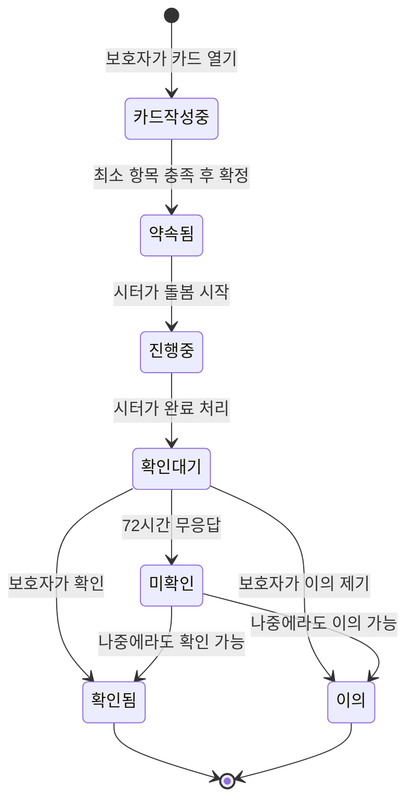
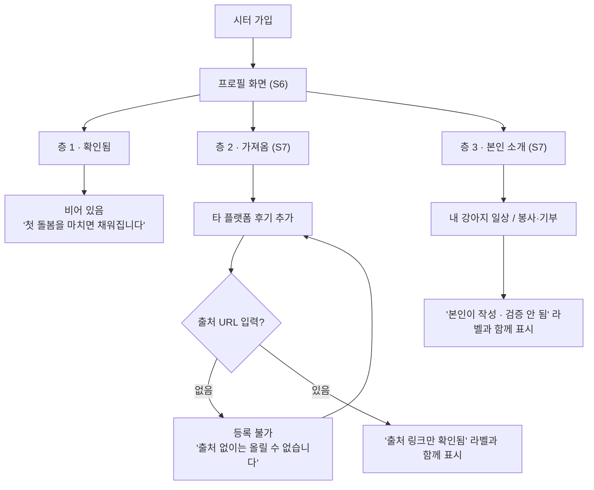
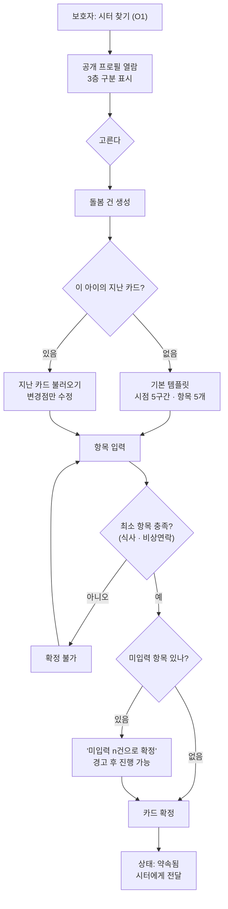
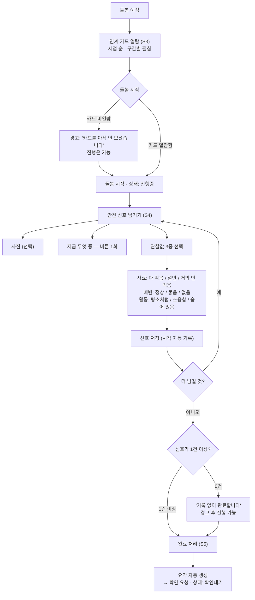
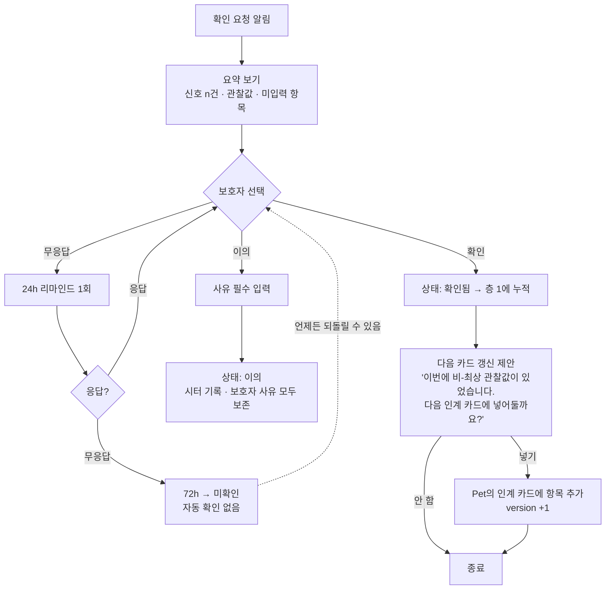
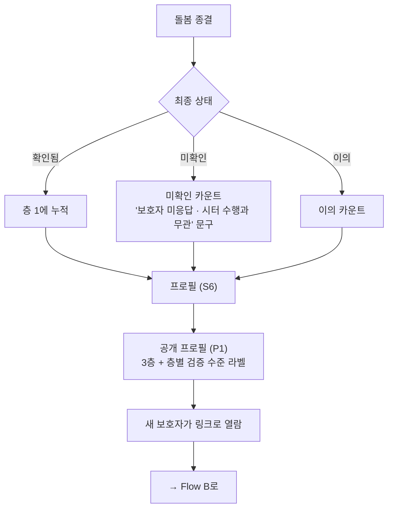

# User Flow · 2판

> ## ⚠ 2026-08-04 — `09-방향전환.md`으로 일부 폐기됨
> 매칭 플랫폼 시안(24화면)으로 방향을 바꿈. **충돌하면 `09`가 이긴다.**
> **결정 2(별점 제거) 철회.** 완화의 원인이 불이익이 아니었음(`08` Q3)

---

> **개정 이력**
> - 1판 (07-27): 3상태값 체크 중심. Flow A~D
> - **2판 (07-28): 인터뷰(`08`) 반영 전면 개정.** 프로필 3층 추가, 수행 체크 → 안전 신호, 보호자 1급화

기준 문서: `02-문제정의`(2판) · `03-IA`(2판) · `07-PRD`(2판)

---

## 0. 1판에서 바뀐 것

| | 1판 | 2판 | 왜 |
|---|---|---|---|
| 수행 기록 | 항목별 `했음/못했음/이상` 전체 체크 | **안전 신호** (사진 + 순간 + 관찰값 3종) | 미수행은 드물고, 왜곡은 **상태**에서 일어남 (Q2·Q3). 전체 체크는 **숙제**였음 (Q7) |
| 이력 | 확인된 건수 | **프로필 3층** | 시터가 보여주고 싶은 건 실적이 아니라 **사람됨** (Q6) |
| 시작 지점 | 인계 카드 작성 | **프로필 만들기** | 보호자가 시터를 고르는 게 먼저 |
| 보호자 | 부 사용자 (단선) | **1급 사용자** | 정책이 시터 6 : 보호자 1로 기울었음 |
| 카드 열람 게이트 | 강제 차단 | **경고로 격하** | Q7의 "숙제처럼 느껴지지 않게" 기준 |

**1판의 확인 병목 결정 1·2는 그대로 유효하다** — 자동 확인 없음 / 확인을 '수령 확인'으로 격하.

---

## 1. 돌봄 건 상태 머신

**「확인됨」만 프로필 층 1에 들어간다.** 「미확인」·「이의」는 별도 카운트로 표시하되 숨기지 않는다.

---

## 2. Flow A — 시터 프로필 만들기 (신규)

**설계 의도**
- **A4가 중요하다.** 신규 시터의 층 1은 비어 있고, 그게 정직한 상태다. 채워진 척하지 않는다
- **A7의 URL 필수**가 층 2를 층 3과 구분하는 유일한 장치다. 없으면 그냥 자기주장
- 층 1은 이 플로우에 **쓰기 경로가 없다.** 시스템이 `jobs`에서 파생 계산할 뿐

---

## 3. Flow B — 보호자: 시터 선택 → 인계 카드

**1판에서 바뀐 지점 — B9/B11이 갈라졌다**

1판은 **필수 5항목 100%를 강제**했다. 그런데 카드를 쓰는 사람은 **보호자**고, 보호자는 이 제품의 주 사용자가 아니다.
**주 사용자가 아닌 사람에게 가장 무거운 게이트를 걸면 서비스가 시작조차 안 된다.**

2판은 나눈다:
- **최소 항목(식사·비상연락)만 필수** — 이게 없으면 돌봄 자체가 위험
- 나머지는 **미입력으로 확정 가능**. 대신 시터 화면에 「미입력 n건」이 보인다

→ 정보가 부족한 채로 시작하는 것은 허용하되, **누가 안 채웠는지는 감춰지지 않는다.**

---

## 4. Flow C — 돌봄 수행 (전면 교체)

**설계 의도**
- **C9~C10이 이 제품의 심장이다.** 자유 서술 칸이 **없다.** 완화는 문장을 쓸 때 일어나므로 문장을 쓰게 하지 않는다
- **C4가 1판에서 격하됐다.** 강제 차단은 주 사용자에게 거는 마찰이라 이탈 위험. 경고로 내리고 열람 여부는 기록에 남긴다
- **C13/C14** — 신호 0건 완료를 막지 않는다. 대신 요약에 "기록 없음"이 남는다. 막으면 앱 밖에서 일한다

---

## 5. Flow D — 확인 (결정 1·2 유지)

**확인은 버튼 하나 + 선택적 한 줄.** 별점·후기 없음 (결정 2).

### D10이 확인 병목의 해법이다 (결정 3 — P0로 복귀)

보호자에게는 확인을 찍을 직접적 이득이 없다. 애는 돌아왔고 결제도 끝났다.
버튼을 누르면 **시터의 프로필이 좋아질 뿐**이다.

D10은 그 순간에 **보호자 자신의 이득**을 붙인다.

> 확인 → "이번에 산책 거부가 있었네요. 다음 인계 카드에 넣어둘까요?" → 넣기
> → 다음번에 **다른 시터**에게 맡길 때 그 내용이 카드에 이미 들어가 있다

**보호자는 시터를 위해서가 아니라 다음번에 자기가 편하려고 찍는다.**
1판에서 이 장치를 만들었다가 2판에서 P1으로 밀었고, **밀고 나니 확인을 찍을 이유가 사라졌다.**
→ **P0로 되돌렸다.** (2026-07-28 결정)

**주의:** 갱신 대상은 **비-최상 관찰값이 있었던 항목**이다. 전부 최상값이면 제안이 뜨지 않는다.
즉 **정직한 기록이 있어야 보호자에게 이득이 생긴다** — 시터의 정직성과 보호자의 이득이 같은 방향으로 정렬된다.

---

## 6. Flow E — 축적 · 공개

---

## 7. 이 플로우를 그리며 잡아낸 오류 · 구멍 ★

### 구멍 1 — 긴급 상황을 담을 자리가 없다 (치명)

2판의 관찰값은 `사료 / 배변 / 활동` 3종뿐이다.
**"아이가 아파 보인다", "다쳤다", "안 보인다"를 넣을 곳이 없다.**

1판에는 「이상 있음」 상태값과 긴급 알림 경로(B12)가 있었는데, **관찰값으로 교체하면서 통째로 사라졌다.**
창고에 갇힌 고양이 유형의 사건을 **2판 설계로는 다시 못 잡는다.**

> **수정:** 안전 신호에 `긴급` 경로를 별도로 둔다. 관찰값과 같은 층이 아니라 **독립 버튼**.
> 누르면 보호자에게 즉시 알림 + 상태 무관하게 기록 최상단 고정.
> 이건 판단을 요구하는 게 아니라 **행동을 요구**하는 것이므로 완화 문제와 무관하다.

### 구멍 2 — 신호를 나중에 몰아서 쓸 수 있다 (높음)

`signals[].at`은 저장 시각이다. 시터가 퇴근 후 5건을 한 번에 입력해도 기록상 구분이 안 된다.
그러면 "그때그때 확인했다"는 증거가 아니라 **사후 서술**이 된다.

> **수정:** 저장 시각과 함께 **돌봄 시작 이후 경과 시간**을 표시하고,
> 완료 처리 후 추가된 신호는 「사후 기록」으로 구분 표시한다. 막지는 않되 감추지도 않는다.

### 구멍 3 — 관찰값이 전부 최상값이어도 시스템이 아무것도 안 한다 (중간)

1순위 지표가 「비-최상 관찰값 비율」인데, 이걸 **감지해서 무엇을 할지가 정의되지 않았다.**

그런데 시터에게 "당신은 전부 최상값만 찍었습니다"라고 알리면 **조작을 유도한다.**
일부러 나쁜 값을 찍게 만드는 건 더 나쁘다.

> **결론: 아무것도 하지 않는다.** 지표는 운영자만 본다. 사용자에게 노출하지 않는다.
> 이건 구멍이 아니라 **의도적 무대응**이며, 그렇게 정했다는 사실을 남긴다.

### 구멍 4 — 층 2 후기의 위조를 막을 수 없다 (높음)

URL을 넣게 했지만, **URL이 진짜 그 후기를 가리키는지 검증하지 않는다.**
깨진 링크, 무관한 링크, 본인이 만든 페이지 모두 통과한다.

> **완화:** 링크를 **클릭 가능하게 노출**하고 도메인을 표시한다. 검증은 **보호자에게 위임**한다.
> 라벨을 "출처 링크 있음"으로 쓰고 **"검증됨"이라고 쓰지 않는다.** 과장하지 않는 것이 최선이다.

### 구멍 5 — 반려동물이 여러 마리일 때 (중간)

카드는 `Pet` 단위인데 돌봄 건은 집 단위일 수 있다. 2마리를 맡겼는데 1마리만 기록되면
**창고 사건과 정확히 같은 실패**(한 마리 사진만 옴)가 재현된다.

> **수정:** 돌봄 건에 반려동물이 2마리 이상이면 **안전 신호를 개체별로** 남기게 하고,
> 완료 시 **기록이 0건인 개체가 있으면 경고**한다.

### ~~구멍 6 — 확인 병목에 해법이 없다~~ → **해결됨 (2026-07-28)**

병목 해법이었던 「다음 카드 갱신 제안」이 2판에서 P1으로 밀렸고,
밀고 나니 **보호자가 확인을 찍을 이유가 사라졌다.** 확인이 안 찍히면 층 1이 비고,
층 1이 비면 프로필에 남는 건 본인이 올린 자기소개뿐 — 증명이 아니라 자기 자랑이 된다.

> **결정: P0로 되돌린다.** (Flow D의 D10~D11)
> 부수 효과 — 갱신 제안은 **비-최상 관찰값이 있을 때만** 뜨므로,
> 시터가 정직하게 기록할수록 보호자에게 이득이 생긴다. 두 인센티브가 같은 방향으로 정렬된다.

### 구멍 7 — 보호자가 카드를 아예 안 만들면 서비스가 시작 안 된다 (중간)

Flow B에서 최소 항목으로 낮췄지만, 여전히 **보호자가 먼저 움직여야** 돌봄이 시작된다.
당근 알바처럼 급하게 잡히는 건에서는 이 순서가 안 맞을 수 있다.

> **미해결.** 시터가 먼저 카드를 만들고 보호자가 확인하는 역방향 경로가 필요할 수 있다. **[추측]**

---

## 8. 예외 처리 표

| 상황 | 처리 | 위치 |
|---|---|---|
| 시터가 카드 미열람으로 시작 | **경고 후 진행 가능.** 열람 여부는 기록에 남음 | C4 |
| 신호 0건으로 완료 | 경고 후 진행 가능. 요약에 "기록 없음" 표기 | C14 |
| 카드 미입력 항목 존재 | 확정 가능. 시터 화면에 「미입력 n건」 표시 | B12 |
| 보호자 72h 무응답 | 미확인 종결. **자동 확인 없음.** 나중에 되돌릴 수 있음 | D8 |
| 보호자 이의 | 양측 기록 모두 보존. 어느 쪽도 삭제 불가 | D9 |
| 돌봄 시작 후 카드 수정 | 원본 유지 + 「추가 요청」 별도 표시 | Flow B |
| 돌봄 중 오프라인 | 로컬 보존 후 복구 시 반영 (프로토타입은 항상 로컬) | C |
| **긴급 상황** | **독립 버튼 → 즉시 알림 + 최상단 고정** | **구멍 1 수정** |
| **완료 후 신호 추가** | 「사후 기록」으로 구분 표시. 막지 않음 | **구멍 2 수정** |
| **개체별 기록 누락** | 완료 시 경고 | **구멍 5 수정** |
| 층 2 링크 무효 | 막지 않음. "출처 링크 있음"으로만 표기 | **구멍 4 완화** |

---

## 9. 이 플로우가 틀렸다면 무엇이 관찰되는가

- **C4를 경고로 낮췄더니 카드 열람률이 급락한다** → 강제가 필요했던 것. 게이트 복원
- **B12(미입력 허용) 때문에 대부분의 카드가 반쯤 빈 채로 확정된다** → 게이트를 낮춘 게 과했음
- **긴급 버튼이 오남용된다** (사소한 일에 누름) → 긴급의 정의가 모호했던 것
- **관찰값을 전부 최상으로만 찍는다** → 결정 3(판단→관찰) 기각. 형식으로 완화를 못 막음
- **보호자가 확인을 안 찍어 층 1이 비어 있다** → 구멍 6이 현실화. 병목 해법을 P0로 되돌려야 함
- **층 2 링크를 아무도 안 클릭한다** → 검증을 보호자에게 위임한 게 작동 안 함. 층 2가 층 3과 다를 게 없어짐

---

## 10. 프로토타입 구현 범위

| 플로우 | 구현 | 생략 |
|---|---|---|
| A 프로필 3층 | **전체** (층 1 파생 계산 · 층 2 URL 필수 · 층 3 자유) | — |
| B 카드 작성 | **템플릿 → 최소 항목 검증 → 미입력 경고 → 확정** | 시터 찾기(1명 고정), 지난 카드 불러오기 |
| C 수행 | **카드 시점별 열람 → 안전 신호(사진·순간·관찰값) → 완료** | 오프라인 복구 |
| D 확인 | **요약 → 확인/이의 → 다음 카드 갱신 제안** | 리마인드·72h 타이머 (수동 전환) |
| E 공개 | **3층 + 검증 라벨 렌더** | 실제 링크 공유 |
| **구멍 1 긴급** | **구현** — 안전 신호와 독립 버튼 | 실제 알림 발송 |
| **구멍 2 사후 기록** | **구현** — 완료 후 추가분 구분 표시 | — |
| 구멍 5 개체별 | 미구현 — 프로토타입은 1마리 | — |

---

## 승인 요청

**승인 전 결정 사항은 모두 처리됨** — 구멍 6은 P0 복귀로 결정 (2026-07-28).

이 문서가 승인되면 다음으로 넘어간다:
1. `06-service-policy.md` 2판 — 위 결정과 구멍 수정 1·2·4·5를 정책 문장으로 고정
2. `07-PRD.md` 갱신 — 구멍 1·2 수정과 D10(다음 카드 갱신)을 P0 기능에 반영

**남은 미해결:** 구멍 7 (보호자가 먼저 안 움직이면 서비스가 시작 안 됨) — 역방향 경로 필요 여부 **[추측]**
